# BigWigs (Séquito del Terror Edition v9.3.0) [God-Tier]

BigWigs es un addon modular de "Boss Mods" diseñado para predecir y alertar sobre habilidades de jefes en bandas y mazmorras. Esta versión ha sido modificada específicamente para integrarse con el ecosistema de **TerrorSquadAI**.

## 🚀 Características Principales

*   **Timers Precisos**: Barras de tiempo para habilidades de jefes (Maldiciones, AoEs, Fases).
*   **Estilo "Terror"**: Interfaz visual rediseñada con tonos oscuros, texturas rasgadas (Otravi) y alertas en rojo sangre.
*   **Alertas Visuales y Sonoras**: Avisos claros cuando debes moverte, interrumpir o usar defensivos.
*   **Cero Fugas de Memoria**: Lógica reescrita para evitar la "contaminación de tablas" (table pollution) en bandas y optimizado para Turtle WoW (Lua 5.0).
*   **Integración TerrorLink**: Envía datos en tiempo real a TerrorSquadAI para coordinar estrategias de grupo.

## 🛠� Instalación y Configuración

El addon funciona "Out of the Box" (sin configuración necesaria), pero puedes personalizarlo:

1.  Escribe `/bw` para abrir el menú de configuración.
2.  **Plugins**: Puedes activar/desactivar módulos específicos (Barras, Mensajes, Sonidos).
3.  **Posición**: Usa `Shift + Click` en las barras para moverlas (cuando están en modo prueba).

## � Uso en Combate

BigWigs se activará automáticamente al entrar en combate con un jefe soportado.

### Tipos de Mensajes
*   **Importante**: Mensaje azul grande. (Ej: "¡Fuego en ti!") -> *Muévete.*
*   **Alerta**: Mensaje amarillo. (Ej: "Fase 2 pronto") -> *Prepárate.*
*   **Boss**: Mensaje rojo. Habilidad del jefe.

## � Integración Terror Ecosystem

Esta versión incluye el plugin **TerrorLink (`TerrorLink.lua`)**.
*   **Qué hace**: Cuando BigWigs detecta una habilidad (ej: "Aliento de Fuego en 5s"), le avisa a `TerrorSquadAI`.
*   **Resultado**: `TerrorSquadAI` puede sugerirte "¡Usa Poción de Protección al Fuego!" o alertar al HUD Táctico.
*   **Estado**: Puedes verificar la conexión con `/terrorlink`.

### � Séquito Ecosystem Compatible (The Eyes of SquadMind)
Como los **Ojos** del clan, BigWigs proporciona la telemetría fundamental para la detección predictiva:

```mermaid
graph TD
    classDef combat fill:#4B0082,stroke:#9370DB,stroke-width:2px,color:#fff;
    classDef core fill:#2C0000,stroke:#FF0000,stroke-width:2px,color:#fff;
    BW["�� BigWigs + TerrorLink<br/>(Detección Jefes)"]:::combat
    TSAI["🧠 TerrorSquadAI<br/>(Comandante Táctico)"]:::core
    WCS["🔮 WCS_Brain<br/>(Vínculo Maestro)"]:::core
    
    BW ==>|Temporizadores Inminentes| TSAI
    TSAI -.->|Reacción Defensiva Automática| WCS
```

Cuando un jefe castea, la información viaja en microsegundos para que `TerrorSquadAI` trace la estrategia a seguir y alerte a `WCS_Brain` para utilizar pociones de protección o pre-castear curas.

## 📋 Comandos Disponibles

*   `/bw` - Abre la configuración principal.
*   `/bw standby` - Desactiva el addon temporalmente (útil si no eres raid leader).
*   `/terrorlink` - Diagnóstico de la integración con IA.

---
*Modificado por DarckRovert para El Séquito del Terror.*
*Para detalles técnicos de la integración, ver `ECOSYSTEM.md`.*

---

## ?? Comunidad y Gobernanza

Este proyecto es parte del ecosistema **El Séquito del Terror**. Nos comprometemos a mantener un ambiente sano y profesional:

- ?? **[Código de Conducta](./CODE_OF_CONDUCT.md)**: Nuestras normas de convivencia.
- ?? **[Guía de Contribución](./CONTRIBUTING.md)**: Cómo ayudar a expandir este addon.
- ??? **[Licencia](./LICENSE)**: Este proyecto está bajo la Licencia MIT.

---
