# 📐 Wiki: Arquitectura 'Diamond Tier' — BigWigs [v2.0.0]

Estructura técnica de la orquestación de banda mantenida por **DarckRovert**.

## 🏗️ Jerarquía del Sistema Boss Mod (Raid Hierarchy)

**BigWigs** utiliza un diseño modular para minimizar el impacto en el rendimiento:

1.  **Encounter Modules (`Raids/`)**: Scripts específicos para cada jefe. Captura eventos `CHAT_MSG_MONSTER_YELL` y `SPELL_CAST_START`.
2.  **Plugin System (`Plugins/`)**: Lógica compartida para renderizar barras (`Bars.lua`), emitir mensajes (`Messages.lua`) y alertas sonoras (`Sound.lua`).
3.  **Core Controller (`Core.lua`)**: El motor de registro de módulos y gestión de la base de datos AceDB.
4.  **Sync Bridge (`TerrorLink.lua`)**: Módulo personalizado del Séquito para compartir estados de boss con el resto de la raid.

---

## 🧭 Diagrama de Flujo: Detección de Encuentro v9.4

```mermaid
graph TD
    A[Inicio: Entrada a Raid] --> B[Registro de Zona por Babble-Zone]
    B --> C[Activación de Módulos de Estancia]
    C --> D{¿Evento de Boss Detectado?}
    D -- Sí --> E[Intercepción de Yell/Combat Log]
    E --> F[Carga de Temporizadores CandyBar]
    F --> G[Emisión de Alerta Sonora/Visual]
    G --> H[Sync vía Comm.lua con la Raid]
    H --> I[Registro en WCS_Brain & TerrorMeter]
    D -- No --> J[Monitoreo Pasivo Throttled]
    J --> D
```

## ⚡ Estrategias de Ingeniería Diamond Tier

- **Ace2 Event Hooks**: Utilizamos los hooks de Ace2 optimizados para el cliente 1.12.1, evitando el uso de bucles `OnUpdate` pesados.
- **Dynamic Module Unloading**: Los módulos de Naxxramas no residen en memoria mientras estás en Karazhan, reduciendo el footprint de memoria.
- **Turtle WoW Event Sync**: BigWigs detecta mecánicas exclusivas de los bosses del servidor mediante el escaneo de buffs/debuffs custom.

---
© 2026 **DarckRovert** — El Séquito del Terror.
*Sincronización táctica para la conquista de Azeroth.*

